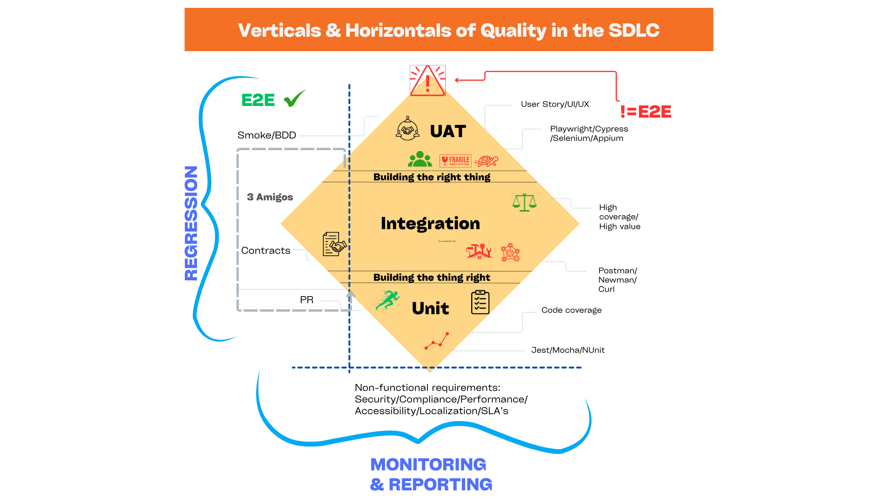

# Payroll API & Mock Broker MVP

This repository demonstrates a comprehensive Node.js payroll API and mock message broker implementation, showcasing modern testing methodologies including contract testing with Pact, performance testing with Artillery, and a complete quality assurance strategy aligned with the "Verticals & Horizontals of Quality in the SDLC" approach.



## Features
- **Payroll API** (Express, port 3000)
  - Employee management (add/list)
  - Timesheet management (clock in/out, view)
  - Basic payroll calculation (total hours worked)
  - Sends clock-in/out events to the mock broker
- **Mock Broker** (Express, port 4000)
  - Receives messages from the API
  - Responds with mock acknowledgments
- **Swagger UI** at `/api-docs` for API exploration
- **Contract Testing** with Pact (consumer and provider tests)
- **Performance Testing** with Artillery (load, stress, spike, and monitoring tests)

## Getting Started

### 1. Install dependencies
```powershell
npm install
cd mock-broker
npm install
```

### 2. Start the services
- Start the payroll API:
  ```powershell
  npm start
  ```
- Start the mock broker (in `mock-broker` folder):
  ```powershell
  npm start
  ```

### 3. Explore the API
- Open [http://localhost:3000/api-docs](http://localhost:3000/api-docs) in your browser for Swagger UI.

### 4. Run contract tests
- Consumer tests (from `pact-tests`):
  ```powershell
  cd pact-tests
  npx jest consumer.test.js
  ```
- Provider verification (requires Docker Desktop):
  ```powershell
  docker run --rm -v C:/Users/Jonathan/Documents/repos/payroll-test/pact-tests/pacts:/pacts pactfoundation/pact-cli:latest verify /pacts/payrollapi-mockbroker.json --provider-base-url=http://host.docker.internal:4000 --provider-states-setup-url=http://host.docker/internal:4000/provider-states
  ```

### 5. Run performance tests
- Quick performance test (30 seconds):
  ```powershell
  npm run test:performance:quick
  ```
- Load test (7 minutes):
  ```powershell
  npm run test:performance
  ```
- Run all performance tests:
  ```powershell
  npm run test:performance:all
  ```
- See `performance-tests/README.md` for detailed performance testing options.

## Endpoints
- `POST /employees` - Add employee
- `GET /employees` - List employees
- `POST /timesheets/clock-in` - Clock in
- `POST /timesheets/clock-out` - Clock out
- `GET /timesheets/:employeeId` - View timesheets for employee
- `GET /payroll/:employeeId` - Get total hours worked

## Testing Methodology

This project implements a comprehensive testing strategy aligned with the "Verticals & Horizontals of Quality in the SDLC" approach, ensuring both functional correctness and non-functional requirements are met throughout the development lifecycle.

### Testing Pyramid: Building the Right Thing Right

Our testing strategy follows a layered approach that addresses different aspects of quality at each level:

#### 🏗️ Integration Layer: Building the Thing Right

**Contract Testing with Pact** - Ensures API and broker integration remains reliable as both services evolve independently.

**Concept:** "Building the thing right" - Validating that components work together correctly.

**How it works:**
1. **Consumer Tests** (`pact-tests/consumer.test.js`): The Payroll API (consumer) defines expected interactions with the Mock Broker (provider)
2. **Pact Generation:** Consumer tests generate contract files (`pact-tests/pacts/payrollapi-mockbroker.json`) specifying expected request/response formats
3. **Provider Verification:** The Mock Broker (provider) is verified against these contracts to ensure it meets the API's expectations
4. **Provider State Setup:** The broker includes `/provider-states` endpoint to prepare specific test scenarios

**Benefits:**
- **API Evolution Safety:** Changes to either service won't break integration
- **Documentation as Code:** Contracts serve as living API documentation
- **Early Bug Detection:** Integration issues are caught before deployment
- **Team Independence:** Teams can work on services independently
- **High Coverage/High Value:** Integration tests provide significant coverage and value

**Test Flow:**
```
Consumer Test → Pact Contract → Provider Verification → Integration Confidence
```

#### 📊 Performance & NFR Layer: Non-Functional Requirements

**Performance Testing with Artillery** - Validates API performance under various load conditions and identifies bottlenecks.

**Concept:** "Building the thing right" - Ensuring non-functional requirements are met.

**Test Types:**

1. **Quick Test** (30s, 5 req/s): Rapid feedback during development
2. **Load Test** (7min, 10-20 req/s): Normal expected load validation
3. **Stress Test** (9min, 10-70 req/s): Breaking point identification
4. **Spike Test** (2.5min, 5→100→5 req/s): Sudden traffic spike handling
5. **Monitoring** (1hr, 2 req/s): Continuous performance monitoring

**Test Scenarios:**
- **Employee Management Flow:** Complete CRUD operations with realistic data
- **Timesheet Operations:** High-frequency clock in/out operations
- **Read Operations:** Data retrieval under load
- **Mixed Operations:** Combination of read/write patterns

**Performance Metrics:**
- **Response Time:** Average, median, 95th percentile
- **Throughput:** Requests per second
- **Error Rate:** Percentage of failed requests
- **Resource Utilization:** CPU, memory, network patterns

**Success Criteria:**
- Error Rate < 5%
- Mean Response Time < 1000ms
- 95th Percentile < 2000ms

**NFR Coverage:** Performance, Security, Compliance, Accessibility, Localization, SLA adherence

### 🔄 Regression Testing: Vertical Quality Assurance

**Purpose:** Ensures new changes don't break existing functionality across all testing layers.

**Coverage:**
- **End-to-End (E2E):** Full system integration validation
- **Smoke/BDD:** Critical path testing with behavior-driven scenarios
- **Integration:** Contract verification and component interaction
- **Code Quality:** Pull Request reviews and automated checks

**Benefits:**
- **Regression Prevention:** Automated testing catches breaking changes
- **Confidence Building:** Comprehensive validation before deployment
- **Risk Mitigation:** Early detection of integration issues

### 📈 Monitoring: Horizontal Quality Assurance

**Purpose:** Continuous validation of non-functional requirements and system health.

**NFR Monitoring:**
- **Performance:** Response times, throughput, and resource utilization
- **Security:** Authentication, authorization, and vulnerability checks
- **Compliance:** Regulatory and policy adherence
- **Accessibility:** User experience and accessibility standards
- **Localization:** Internationalization and localization support
- **SLA's:** Service level agreement compliance

**Continuous Quality:**
- **Real-time Metrics:** Live performance and health monitoring
- **Alerting:** Proactive issue detection and notification
- **Trend Analysis:** Long-term performance and quality tracking

### Testing Strategy Benefits

**Development Workflow:**
- **Contract Tests:** Run on every code change to catch integration issues
- **Performance Tests:** Run before deployments to validate performance
- **Continuous Monitoring:** Production-like testing to identify degradation

**Quality Assurance:**
- **Functional Reliability:** Contract tests ensure correct behavior
- **Performance Validation:** Load tests verify capacity requirements
- **Regression Prevention:** Automated testing catches breaking changes

**Team Collaboration:**
- **Clear Contracts:** Developers understand integration requirements
- **Performance Baselines:** Teams can track performance improvements
- **Shared Understanding:** Testing approach aligns team expectations

### 🛠️ Testing Tools & Implementation

**Integration Testing Tools:**
- **Postman/Newman:** API testing and contract validation
- **Pact:** Consumer-driven contract testing
- **Curl:** Command-line API testing and validation

**Performance & NFR Tools:**
- **Artillery:** Load testing, stress testing, and performance validation
- **Custom Monitoring:** Continuous performance tracking and alerting
- **Metrics Collection:** Response time, throughput, and error rate analysis

**Code Quality Tools:**
- **Pull Request Reviews:** Code quality gates and validation
- **Automated Testing:** CI/CD pipeline integration
- **Coverage Analysis:** Code execution and test coverage metrics

### When to Run Each Test Type

**During Development:**
- **Contract Tests:** Every code change affecting API integration
- **Quick Performance Tests:** After significant code changes
- **Provider Verification:** Before deploying broker changes

**Before Deployment:**
- **Contract Tests:** Full consumer/provider verification
- **Load Tests:** Validate performance under expected load
- **Stress Tests:** Ensure system can handle peak traffic

**In Production:**
- **Monitoring Tests:** Continuous performance tracking
- **Contract Tests:** Verify integration after deployments
- **Spike Tests:** Validate autoscaling and recovery

**For Optimization:**
- **Stress Tests:** Identify bottlenecks and breaking points
- **Load Tests:** Measure performance improvements
- **All Tests:** Establish performance baselines

## Notes
- All data is stored in-memory for demonstration.
- Contract tests ensure API and broker integration stays reliable.
- The mock broker includes provider state setup endpoints for Pact testing to eliminate warnings.
- Performance tests provide actionable insights for optimization and capacity planning.

## 🎯 Quality Assurance Summary

This testing methodology implements the **"Verticals & Horizontals of Quality"** approach:

**🔴 Vertical Quality (Regression Testing):**
- **UAT Layer:** User story validation and UI/UX testing
- **Integration Layer:** Contract testing and component interaction
- **Code Quality Layer:** PR reviews, coverage analysis, and automated checks

**🔵 Horizontal Quality (Monitoring):**
- **Continuous NFR Validation:** Performance, security, compliance, and SLA monitoring
- **Real-time Quality Metrics:** Live system health and performance tracking
- **Proactive Issue Detection:** Alerting and trend analysis for quality degradation

**🟠 Testing Pyramid Foundation:**
- **Building the Right Thing:** User acceptance and business value validation
- **Building the Thing Right:** Technical correctness and non-functional requirements
- **Continuous Quality:** Regression prevention and ongoing monitoring

This approach ensures comprehensive quality coverage across all aspects of the software development lifecycle, from initial development through production deployment and ongoing maintenance.
